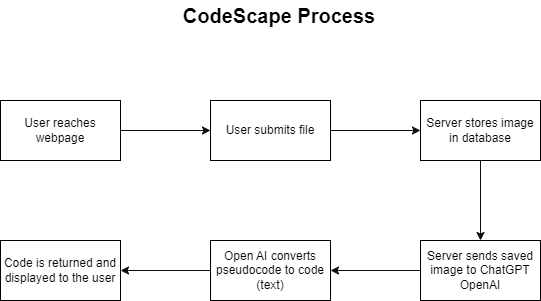

<!-- Improved compatibility of back to top link: See: https://github.com/othneildrew/Best-README-Template/pull/73 -->
<a name="readme-top"></a>

<!-- PROJECT LOGO -->
<br />
<div align="center">
  <a href="https://github.com/github_username/repo_name">
    
  </a>

<h3 align="center">VCU MegaHack-CodeScape</h3>

  <p align="center">
    Everyone says the best way to conquer a coding problem is to write it out. Our goal at CodeScape is to convert your pseudocode into actual code. By utilizing modern-day AI like ChatGPT, we are able to take in photos and release a mockup of your code in any desired language.
    <br />
    <a href="https://github.com/github_username/repo_name"><strong>Explore the docs »</strong></a>
    <br />
    <br />
    <a href="https://github.com/github_username/repo_name">View Demo</a>
  </p>
</div>

<!-- ABOUT THE PROJECT -->
## About The Project
This project is a submission for VCU's MegaHacks Hackathon, where we were tasked to develop a simple web application that performs a useful function. For example, it could be a task tracker, a note-taking app, a weather app, etc. 


### Inspiration
CodeScape was inspired by the typical problem that developers have when converting pseudocode into real code. In our opinion planning and organizing your ideas before implementing them can be made easier by using pseudocode to visualize your thought process of approaching the problem. By utilizing ChatGPT, a AI tool, to read and produce code based on your pseudocode, CodeScape seeks to close the gap between planning and execution.

### What it does: 
Pseudocode may be entered into CodeScape and converted into actual code segments in any preferred programming language. This is accomplished by first translating the pseudocode into executable code using ChatGPT's skills to understand the logic and intent behind it. Users may choose the target programming language, submit their pseudocode, and get a code sample in return. 

### How we built it: 
We chose to use HTML, CSS, and JavaScript to build the front-end and then Python to cover the back end. While exploring the scopes of HTML, CSS, and JS, we were able to create a functioning web application and learned more about new tags that would help us connect our front-end to the back-end (like <input> to allow the user to provide the webpage with an image from their PC). We incorporated Python with our project by running scripts that would access the OpenAI API to decipher human text (pseudocode) and return code in languages that the user asked for.


### Challenges we ran into:
Finding ways to save the inputted images into our device
Finding a file type that would be valid to upload when converting to pseudocode. 
Linking the image from the database to ChatGPT
Optimizing the AI model 
Code Conceptual Correctness


### Accomplishments that we're proud of:
We are proud of our beautiful front-end along with our end result, which successfully allows the user to easily insert an image and get the code back.

### What we learned:

### What's next for CodeScape:
User account
Add more language compatibility
Improved handwritten character recognition
Expanded human language support


### Built With
[![HTML][HTML-shield]][HTML-url] [![CSS][CSS-shield]][CSS-url] [![Node.js][NodeJS-shield]][NodeJS-url] [![Python][Python-shield]][Python-url]

<!-- GETTING STARTED -->
## Getting Started

### Prerequisites

This is an example of how to list things you need to use the software and how to install them.
* npm
  ```sh
  npm install npm@latest -g
  ```

### Installation

1. Get a free API Key at [https://example.com](https://example.com)
2. Clone the repo
   ```sh
   git clone https://github.com/github_username/repo_name.git
   ```
3. Install NPM packages
   ```sh
   npm install
   ```
4. Enter your API in `config.js`
   ```js
   const API_KEY = 'ENTER YOUR API';
   ```
5. Install Node.js
  ```js
  Download and install from [here](https://nodejs.org/en/download/)
  ```
6. Install Python 
```sh
Download and install from [here](https://www.python.org/downloads/). 
Make sure it's added to PATH during installation.
```
7. OpenAI Account
```sh
Signup for OpenAI account (free tier will work).
Install GPT-3 model by running this command in terminal:
bash
curl -sS https://raw.githubusercontent.com/openai/engines/
master/install_gpt-j-6B.sh | bash (Note that this may take some time as it downloads the model.)
```
8. OpenAI Libraries
```sh
Inside the project folder, run these commands in terminal:
pip install openai
```

<!-- USAGE EXAMPLES -->
## Usage

Use this space to show useful examples of how a project can be used. Additional screenshots, code examples and demos work well in this space. You may also link to more resources.

_For more examples, please refer to the [Documentation](https://example.com)_

<!-- ROADMAP -->
## Roadmap
<a>
<div align="center">
    
  </a>


See the [open issues]https://github.com/GokulCh/MegaHack-CodeScape/issues) for a full list of proposed features (and known issues).

<!-- CONTRIBUTING -->
## Contributing

Contributions are what make the open source community such an amazing place to learn, inspire, and create. Any contributions you make are **greatly appreciated**.

If you have a suggestion that would make this better, please fork the repo and create a pull request. You can also simply open an issue with the tag "enhancement".
Don't forget to give the project a star! Thanks again!

1. Fork the Project
2. Create your Feature Branch (`git checkout -b feature/AmazingFeature`)
3. Commit your Changes (`git commit -m 'Add some AmazingFeature'`)
4. Push to the Branch (`git push origin feature/AmazingFeature`)
5. Open a Pull Request

<!-- CONTACT -->
## Contact
1. Prakash Chatlani - [@prakashhc](https://github.com/prakashhc) - chatlanipr@vcu.edu
2. Gokul Chaluvadi - [@GokulCh](https://github.com/GokulCh) - chaluvadig@vcu.edu
3. Harita Agarwal - [@hpa179](https://github.com/hpa179) - agarwalhp@vcu.edu
4. Kshitij Kokkera - [@kshitijkokkeravcu](https://github.com/kshitijkokkeravcu) - kokkerak@vcu.edu

<!-- MARKDOWN LINKS & IMAGES -->
<!-- https://www.markdownguide.org/basic-syntax/#reference-style-links -->

[HTML-shield]: https://img.shields.io/badge/HTML-239120?style=for-the-badge&logo=html5&logoColor=white
[HTML-url]: https://html.com/

[CSS-shield]: https://img.shields.io/badge/CSS3-1572B6?style=for-the-badge&logo=css3&logoColor=white
[CSS-url]: https://html.com/

[NodeJS-shield]: https://img.shields.io/badge/Node.js-43853D?style=for-the-badge&logo=node.js&logoColor=white
[NodeJS-url]: https://nodejs.org

[Python-shield]: https://img.shields.io/badge/python-3670A0?style=for-the-badge&logo=python&logoColor=ffdd54
[Python-url]: https://www.python.org/